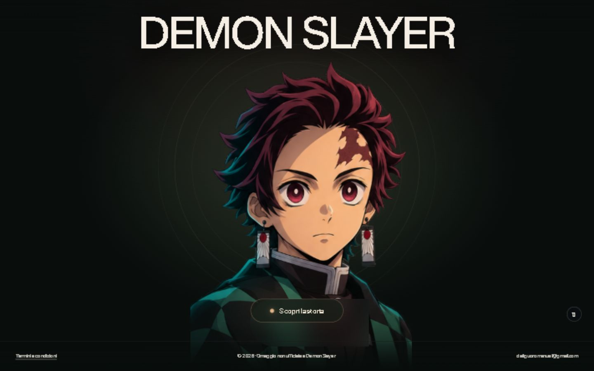

# La storia di Tanjiro — Anteprima

Un’esperienza web immersiva dedicata a Tanjiro e Nezuko, con ritratti interattivi e quattro ricordi che raccontano l’inizio di **Demon Slayer**. Questo repository contiene il codice sorgente, le illustrazioni e i prompt usati per realizzare il sito.

**Sito pubblico su GitHub Pages:** [home](https://deliguoromanuel-stack.github.io/la-storia-di-tanjiro-anteprima/) · [la storia](https://deliguoromanuel-stack.github.io/la-storia-di-tanjiro-anteprima/storia/)

Il sito su GitHub Pages è accessibile pubblicamente. L’[anteprima originale su Sites](https://mainframe-tanjiro-story.deliguoromanuel.chatgpt.site/) resta privata e può richiedere un account autorizzato. Il progetto si può eseguire anche sul proprio computer seguendo le istruzioni sotto.



## L’esperienza

- **Home a schermo intero:** titolo Demon Slayer, ritratto di Tanjiro e pulsante “Scopri la storia”.
- **Ritratti animati:** Tanjiro e Nezuko seguono il mouse con gli occhi; la testa si gira leggermente e capelli, orecchini o fiocco reagiscono al movimento. In condizioni normali sono presenti respiro, battiti delle palpebre e un sorriso occasionale.
- **Quattro capitoli:** la famiglia, la notte da Saburo, la trasformazione di Nezuko e l’incontro con Giyu. Il testo contiene spoiler del primo episodio.
- **Scene immersive:** illustrazioni a schermo intero con movimenti locali dei personaggi. Sui telefoni l’inquadratura si sposta durante lo scroll per accompagnare la lettura e mostrare i protagonisti.
- **Transizioni di pensiero:** il passaggio tra home e storia parte dal pulsante; il cambio di capitolo durante lo scroll attiva un passaggio visivo. Tre varianti casuali richiamano acqua, fuoco e nebbia.
- **Controlli:** navigazione tra capitoli, pausa delle animazioni, avviso cookie e finestra dei termini e condizioni.

## Come sono realizzate le animazioni

I ritratti usano **atlanti di espressioni e una mesh WebGL**. La deformazione della mesh muove separatamente testa, capelli e accessori; il campionamento della texture nelle regioni degli occhi genera lo sguardo. Il battito delle palpebre e il sorriso passano tra fotogrammi dell’atlante.

Le scene della storia usano illustrazioni dedicate e una mesh con regioni individuate per ciascun personaggio. Gli occhi reagiscono al puntatore e le deformazioni locali aggiungono piccoli gesti, respiro e movimento di capelli, abiti, lanterna o spada, secondo la scena. Sono animazioni procedurali delle illustrazioni, con movimenti contenuti: non sono filmati dell’anime né modelli 3D completi.

### Movimento ridotto e fallback

- Con `prefers-reduced-motion: reduce`, i ritratti interrompono respiro, battito delle palpebre e sorriso automatici; le scene interrompono i piccoli gesti automatici. La neve è nascosta e le transizioni sono attenuate. Lo sguardo e la lieve rotazione richiesti dal mouse restano disponibili; sui telefoni resta il movimento dell’inquadratura legato allo scroll.
- Sui dispositivi touch le animazioni automatiche funzionano senza richiedere il mouse, salvo la preferenza per movimento ridotto.
- Il pulsante di pausa congela i personaggi e l’inquadratura delle scene, e sospende la neve. Le transizioni di navigazione e di capitolo restano attive.
- Se WebGL non è disponibile, i ritratti conservano il fallback basato sull’atlante di espressioni, ma perdono il controllo completo della mesh. Le scene mostrano la loro illustrazione statica: in questo caso non c’è animazione facciale delle scene.

## Avvio locale

Servono **Node.js 20.19 o successivo della serie 20, oppure Node.js 22.12 o successivo**, e **pnpm** disponibile nel terminale.

Nella cartella del repository:

```sh
pnpm install
pnpm dev
```

Apri l’indirizzo indicato dal terminale, normalmente `http://127.0.0.1:5173/`. La home è `/`; la storia è `/storia`.

### Build di produzione

```sh
pnpm build
```

La build esegue il controllo TypeScript e genera il sito statico nella cartella `dist/`. Per pubblicarlo su un hosting diverso, configura il ritorno a `index.html` per le rotte dell’app, compresa `/storia`.

### Pubblicazione su GitHub Pages

Il workflow `.github/workflows/pages.yml` compila e pubblica automaticamente il sito a ogni aggiornamento di `main`. In **Settings → Pages**, la sorgente deve essere **GitHub Actions**.

```sh
pnpm build:pages
```

Questa build usa il prefisso `/la-storia-di-tanjiro-anteprima/` per script, immagini e navigazione. Genera anche `storia/index.html`, così il link diretto alla storia e il ricaricamento della pagina funzionano su Pages. GitHub Pages deve pubblicare la build `dist/`: i file sorgenti React non si possono pubblicare direttamente come sito statico.

## Stack

- React 19 e TypeScript
- Vite 7
- Tailwind CSS 4
- WebGL e API native del browser, senza librerie UI aggiuntive

Le versioni delle dipendenze sono definite in `package.json` e bloccate in `pnpm-lock.yaml`.

## Struttura del progetto

```text
src/
  App.tsx                Home, storia, capitoli, transizioni, cookie e termini
  AnimatedPortrait.tsx   Interazione e ciclo di animazione dei ritratti
  portraitRig.ts         Rendering WebGL e deformazioni dei ritratti
  StoryScene.tsx         Rendering delle scene e inquadratura durante lo scroll
  index.css              Layout, atmosfera e transizioni
public/assets/           Atlanti dei ritratti, quattro scene e sfondo del bosco
asset-prompts/            Prompt di creazione delle illustrazioni
docs/                    Screenshot dell’anteprima
.openai/hosting.json      Configurazione del sito su Sites
index.html               Documento iniziale e metadati
vite.config.ts           Configurazione di Vite e Tailwind CSS
```

La configurazione di hosting identifica il progetto esistente, ma non fornisce credenziali né accesso al suo account. `node_modules/` e `dist/` si generano localmente e non sono necessari nel repository.

## Cookie, privacy e contatti

Il sito aggiunge il cookie tecnico `ds_cookie_notice`, che ricorda per un anno la chiusura dell’avviso iniziale. È impostato con `SameSite=Lax` e, quando il sito viene aperto tramite HTTPS, con `Secure`. È possibile rimuoverlo dalle impostazioni del browser.

Il codice del progetto non aggiunge analytics né cookie pubblicitari. Il servizio di hosting può gestire dati e cookie necessari all’accesso e alla sicurezza secondo la propria informativa; il caricamento dei font esterni comporta inoltre richieste al relativo servizio. I dettagli presenti nel sito si aprono dal collegamento “Termini e condizioni” nel footer.

Per contatti o segnalazioni: **deliguoromanuel@gmail.com**.

## Progetto non ufficiale e diritti

Questo è un **fan project non ufficiale**, senza affiliazione con i titolari di Demon Slayer. Personaggi, nomi e opera appartengono ai rispettivi titolari. Le illustrazioni sono state generate appositamente per questa esperienza e i relativi prompt sono inclusi in `asset-prompts/`.

Il repository non attribuisce diritti sui personaggi e non dichiara una licenza di riutilizzo del codice o delle immagini. Per eventuali usi ulteriori occorre verificare i diritti e le autorizzazioni pertinenti.
